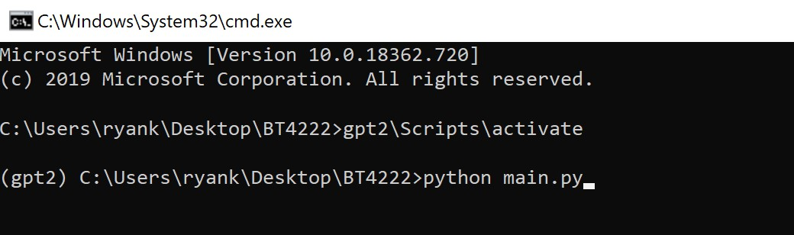
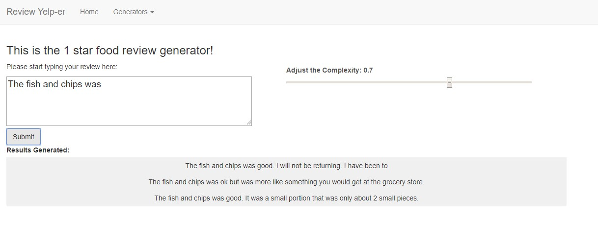
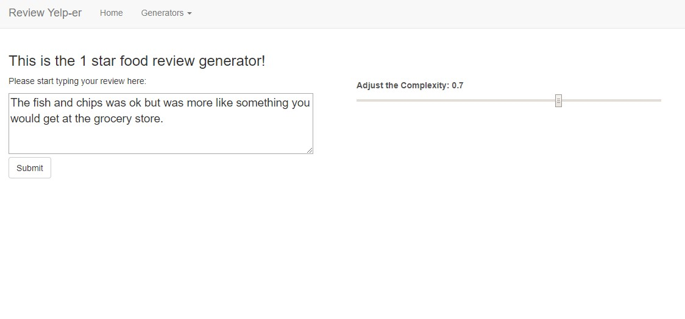
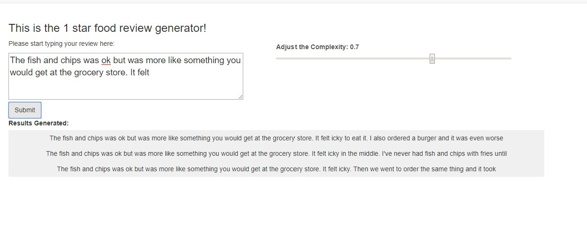

# Review-Yelp-er
A text generation project as part of BT4222 - Mining Web Data for Business Insights. 

As one of our teammates returned from US after his exchange, he realised that there was one problem he faced when he stumbled upon good food using Yelp - there is a word limit requirement before you can leave a review. He felt that this requirement was a chore and this deterred him from giving reviews. 

Hence, we thought that we could use Deep Learning to solve this problem by creating a Review "Yelp-er". By suggesting sentences based on an input, this would help users like our teammate by giving them suggestions and possibly even writing whole the review. 

# Consolidated dataset
Google drive to store our dataset as the files are big and unable to be uploaded to github. (Link)

# General Setup
1. Run pip install -r requirements.txt
2. Download dataset and place it in the same folder as notebook
3. If running on local, ensure that CUDA is installed and you have a good GPU

# System Requirements
1. Lots of RAM (At least 20GB)
2. At least 1 GPU
3. Harddisk memory of at least 20GB (3GB for 1 model checkpoint, Yelp Dataset is 5GB before cleaning)

# Data Cleaning
__Objective__ \
To preprocess the dataset, which can be found at https://www.yelp.com/dataset

__Content__
1. Basic NLP Text cleaning
2. Convert from json to csv
3. Inner join business.json and review.json
4. Filter to keep only current open businesses
5. Filter to keep review stars 1 and 5
6. Filter to keep reviews that have more than 1 usefulness rating

# Exploratory Data Analysis
__Objective__ \
To observe the distribution of words between a good review and a bad review. \
View scatterplot at https://zh-tan.github.io/review-yelper.github.io/. \
It takes about 2-5mins to load. 

__Content__
1. Produce scatterplot using scattertext

# LSTM
__Objective__ \
Train 2 LSTM models on 1 star and 5 star reviews. Note that this is only scoped to food-related reviews.

__Setup__
1. Ensure that the reviews1_cleaned.txt and reviews5_cleaned.txt are in the datafiles folder.
2. Code needs to be ran on tensorflow version 1
3. Code has to be ran on colab with 25gb ram (>12 gb ram will be used) and runtime has to be either GPU or TPU.

__Content__
1. Train on food reviews (1 star)
2. Train on food reviews (5 stars)

# GPT-2
__Objective__ \
This is the training phase of GPT-2. Elaborated in our report and presentation, we have decided to train on both general and food models. 

__Setup__
1. Ensure that gpt-2-simple package is installed and you have sufficient RAM and GPU to train the large model
2. Make sure that dataset is in same folder as notebook
3. This was trained in Colab with GPU and High RAM (30GB RAM) and Google Cloud Platform (1x P100 GPU and 15GB n1-standard-4 CPUs)
4. Ensure you have at least 10 GB of harddisk space

__Content__ \
Train 2 GPT-2 Large models on Food and General dataset.
1. Trained on General (Review star 1) 
2. Trained on General (Review star 5) 
3. Trained on Food (Review star 1) 
4. Trained on Food (Review star 5) 

__Autoregressive Property__ \
Review Star 1 \
 \
Review Star 5 \
 \

__PCA on Tensorboard__ 
 

# Demo
__Objective__ \
To generate a Proof-of-Concept using the trained GPT-2 models. We created an app that simulates the autocomplete feature. Instead of just suggesting a word, the autocomplete feature is able to suggest 3 sentences based on the input given. 

__Setup__ \
Ensure you are in the directory of the py files and just run main.py
 

__Instructions__ 
1. There are dropdowns for you to select the type of model to use (1 star or 5 star)
2. There is a scale on "complexity", which uses temperature scaling to enable the mode to generate more complex outputs. A higher number results in more flamboyant language. 
3. Key in text
4. Click submit
5. Repeat

__Example__ 
1. You may key in any input you like. Let's say the fish and chips were bad but I do not know how to describe it, let's key in "The fish and chips was"
2. Click on submit and the model will generate 3 suggestions for you to pick
 
3. Click on any of the suggestions and the text would autocomplete your input
 
4. You may edit the the model's suggestion and click on submit once the description is fitting
 
5. Repeat until you are satisfied with the length and quality of the review generated
